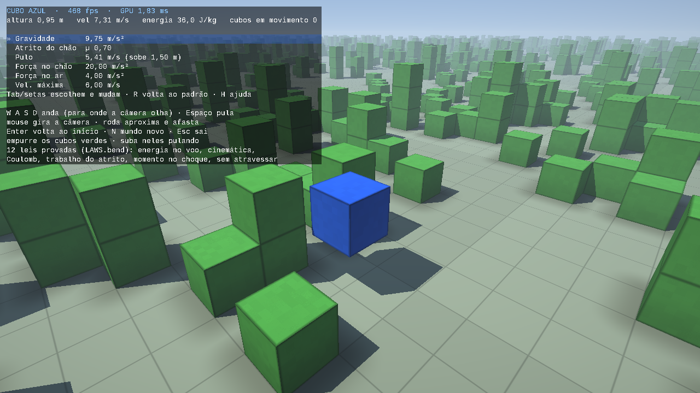
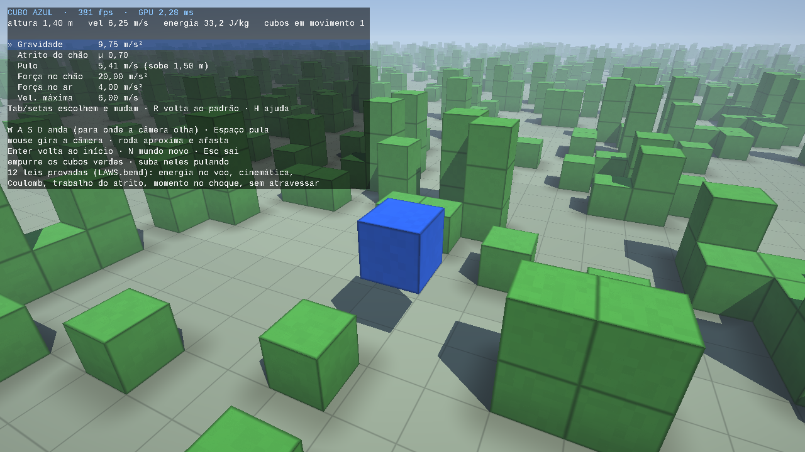

# Cubo Azul

Um jogo 3D em [Bend 2](https://github.com/bendlang/bend): você é o **cubo
azul**. Anda, pula, **empurra os cubos verdes** e **sobe neles**. Os cubos
verdes nascem ao acaso (uma semente nova a cada partida), em pilhas de 1 a 3,
num mundo **sem fim**: meio milhão de quilômetros para cada lado.

A física segue as leis da cinemática, da conservação da energia e do atrito
de Coulomb, e isso é **provado**. São dezenove leis em [`LAWS.bend`](LAWS.bend),
e `bend PROOF.bend` só passa se todas valem. Elas valem para **qualquer valor
das constantes**, e isso importa porque gravidade, atrito, pulo e motor mudam
durante o jogo.

A GPU desenha (Vulkan); o Bend simula.




## Jogar

```sh
./build.sh      # checa PROOF.bend, depois compila ./cubo
./cubo
```

| tecla | ação |
|---|---|
| W A S D | andar (para onde a câmera olha) |
| Espaço | pular (segurado, pula de novo ao tocar o chão) |
| mouse | girar a câmera |
| roda | aproximar / afastar a câmera |
| Tab, ↑ ↓, 1 … 4 | escolher uma constante |
| ← → | mudar a constante escolhida (segurar repete) |
| R | constantes de volta ao padrão |
| C | alinhar no meio da pista, reto |
| Enter | voltar ao início |
| N | mundo novo (outra semente) |
| H | mostrar / esconder as teclas |
| Esc | sair |

Andar acelera 20 m/s² enquanto a tecla estiver segurada, e o atrito tira
7,8 m/s²: sobram 12,2 m/s² que não param de somar — **não há velocidade
máxima**, e a aceleração é a mesma em qualquer velocidade (`motor_is_steady`).
O motor solta a 15000 m/s, e isso não é física: é onde o número acaba. Um
`Nat` em Bend vai até 2^48−1, e o quadrado da velocidade (a energia, e a raiz
que o atrito tira) tem que caber nele, o que termina em 16384 m/s. Passar
disso derrubava o jogo; agora o jogo só para de empurrar, como se a tecla
tivesse sido solta, e o HUD escreve `(teto)`. Nenhuma lei mudou.
Num trecho limpo dá 12 m/s em 1 s e 122 m/s em 10 s; no mundo de verdade os
cubos que você encontra pelo caminho seguram você por volta de 6 m/s. Por isso
o ponto de partida fica numa **pista reta**: 8 m de largura pelo eixo z (para
onde a câmera olha ao começar), sem fim e sem nenhum cubo verde, pintada no
chão com a faixa do meio tracejada.

Acertar a pista no olho não dá: a câmera tem 1024 passos por volta, e um passo
torto já põe um empurrão para o lado (76 de 4096) que em dez segundos te joga
na parede de cubos. **C alinha**: põe você exatamente na faixa do meio, zera a
velocidade lateral e aponta a câmera para a ponta mais próxima da pista — as
duas únicas direções em que o passo para o lado é exatamente zero. Daí é só
segurar W. No ar
o motor não faz nada: saiu do chão, o que manda é a parábola
(`no_air_control`).

Um cubo só é segurado pelo que está embaixo do meio dele. Empoleirado numa
quina, com o meio para fora do apoio, ele **escorrega da beirada e cai** --
um passo de 6 cm por tick, que não muda velocidade nem altura, então não
inventa energia. Dois cubos com um vão entre eles seguram um terceiro por
cima: o que conta é o meio estar dentro do vão coberto pelos apoios.

Para empurrar, é só andar contra um cubo verde. Ele sai com a sua velocidade
dividida entre os dois (a colisão conserva o momento) e desliza até o atrito
pará-lo. Empurra também uma fila inteira. Um pulo sobe 1,5 m com as
constantes padrão, o bastante para subir num cubo de 1 m e, dali, numa pilha
de 2. Tire um cubo de baixo de uma pilha e os de cima caem.

`./cubo demo` joga sozinho (W segurado, um pulo a cada 1,5 s, a câmera
girando). `./cubo still` usa a semente fixa 12345, sem nada se mover, para
medir.

Precisa de Linux com X11 (XWayland serve), clang e um driver Vulkan (Mesa
RADV/ANV ou o do fabricante; a `libvulkan` é carregada na execução). O
`build.sh` recompila o shader com `glslc` se houver; senão usa o SPIR-V já
embutido em `effs/screen.c`.

### As constantes

Todas mudam durante o jogo; o painel mostra o valor em unidades físicas.
Nenhuma tem teto: sobem o quanto você quiser, e as leis valem para qualquer
valor que elas alcancem.

| constante | padrão | passo | o que é |
|---|---|---|---|
| Gravidade | 9,75 m/s² | 0,5 | a velocidade que a gravidade tira a cada tick |
| Atrito do chão | µ 0,80 | 0,05 | Coulomb: o chão freia µ·g (a força normal é m·g); 0,80 é borracha em asfalto seco |
| Pulo | 5,41 m/s | 0,25 | a velocidade de saída; o painel mostra a altura que a energia dá, J²/2g |
| Força no chão | 20 m/s² | 1 | o empurrão do "motor" ao andar; no ar o motor não faz nada |

O painel mostra também, a cada frame, a altura, a velocidade e a **energia
mecânica** do cubo azul em J/kg. Num pulo ela fica parada enquanto ele voa.

## As leis

Em [`LAWS.bend`](LAWS.bend), provadas em [`PROOF.bend`](PROOF.bend). Cada lei
é sobre o tick de verdade do jogo, `Body.tick` (o mesmo que o jogo roda), e
vale para qualquer corpo, qualquer conjunto de obstáculos em volta e
qualquer valor de todas as constantes. Algumas pedem "sem entrada"; outras
pedem "sem contato", um tick em que nenhum portão de colisão barrou o
movimento. O tick marca isso no próprio corpo (`hit`).

| lei | o que garante |
|---|---|
| `free_flight_energy` | no ar, sem entrada e sem contato, a energia mecânica (cinética + potencial) é **exatamente** a mesma depois do tick |
| `free_flight_kinematics` | o mesmo tick é movimento uniformemente acelerado: `v' = v − g`, a horizontal não muda (sem atrito no ar), e cada coordenada anda `v + v'` (a velocidade média) |
| `flight_is_parabola` | um voo inteiro, de qualquer duração e com quaisquer obstáculos em volta, é **exatamente** a parábola da física real: depois de n ticks (t = n/128 s), `v = v₀ − a·t`, `y = y₀ + v₀·t − ½·a·t²` e `x = x₀ + vₓ·t`, com a = g/8 m/s² (9,75 m/s² no padrão), sem erro que se acumule |
| `jump_energy` | um pulo sem contato dá ao corpo **exatamente** `J²` de energia vertical; somada a `free_flight_energy`, a altura do pulo é a da conservação da energia |
| `no_air_jump` | no ar, segurar o pulo não muda nada (pular exige apoio) |
| `no_air_control` | no ar, segurar uma direção não muda nada: o motor empurra contra o chão, e em voo não há contra o que empurrar |
| `motor_is_steady` | no chão, andar soma **exatamente** `acc` na direção pedida, seja qual for a velocidade atual: não há velocidade máxima, e o empurrão não enfraquece nem cresce com a velocidade |
| `friction_never_reverses` | no chão, sem entrada, o atrito só freia: nenhum componente da velocidade cresce ou troca de sentido |
| `coulomb_friction` | o atrito de um tick tem módulo no máximo µ·g, em qualquer direção de deslize: `fx² + fz² ≤ (µg)²` |
| `friction_work` | teorema trabalho-energia: a energia cinética perdida é **exatamente** o atrito vezes a distância deslizada, e o corpo desliza essa distância |
| `rest_stays` | atrito estático: um corpo parado e apoiado, sem entrada e sem batida, fica exatamente onde está -- só o modo como ele está virado pode mudar, porque o apoio empurra para cima e onde esse empurrão cai é o que o vira |
| `push_momentum` | uma colisão (o empurrão) **conserva o momento** exatamente |
| `push_energy` | uma colisão nunca cria energia cinética |
| `energy_never_grows` | sem entrada, nenhum tick aumenta a energia do corpo mais a dos obstáculos que ele toca; só o motor e o pulo põem energia |
| `no_clip` | um corpo livre dos obstáculos continua livre depois do tick, com qualquer entrada: nada anda, cai ou é empurrado para dentro de outro cubo |
| `free_spin_keeps_the_turning` | um corpo que não toca em nada mantém o giro **exatamente**: um cubo resiste igual a girar em torno de qualquer eixo, então nada alimenta uma bamboleada |
| `a_hit_adds_the_whole_turning` | uma batida põe no corpo **todo** o giro que ela pede — as três partes do braço cruzado com o impulso, não só a que cai num eixo que o corpo já usava |
| `no_spin_from_the_middle` | uma batida no meio não gira nada: o que gira é o braço, e braço zero não cruza com nada |
| `spin_is_across_the_push` | uma batida só gira em torno dos eixos atravessados a ela |

Não há `@unsafe`, `?TODO` nem axiomas. A verificação leva alguns minutos e
precisa de mais pilha do que um shell costuma dar: `./build.sh` pede
`ulimit -s 1000000` e passa `BUN_JSC_maxPerThreadStackUsage`. Sem os dois o
checador morre com "machine stack overflow" antes de terminar.

### Rotação: o que é exato e o que não é

Cada corpo carrega **o giro como vetor** (quanto de uma volta inteira ele
faz em cada eixo por tick) e **a orientação como quatérnio** em 2⁻¹⁵. A
escolha é deliberada, e a fronteira entre exato e aproximado está aqui:

- **Exato:** o giro. Uma batida soma ao giro o braço cruzado com o impulso,
  em inteiros, sem arredondar nada; um tick sem contato não mexe nele. As
  quatro leis acima são sobre essas contas.
- **Aproximado:** a orientação. Compor rotação com rotação em ponto fixo não
  fecha em inteiros (é o mesmo motivo pelo qual nenhum motor faz isso): cada
  tick que gira multiplica o quatérnio pela volta daquele tick e traz o
  tamanho de volta para 2¹⁵ — certo a 2⁻¹⁵ de si mesmo, um micrômetro num
  cubo de um metro.
- **O seno e o cosseno** saem de séries em 2⁻²⁰ com toda divisão arredondada
  (`Trig`): erro máximo medido de 1,2 · 10⁻⁵, e **exatos** nos quartos de
  volta — um cubo que não girou é exatamente quadrado.
- **A colisão de um cubo virado** é o teste dos quinze eixos separadores
  (`Geo.sat`): as três faces de cada cubo e os nove cruzamentos das arestas,
  tudo multiplicado para não dividir. Enquanto os dois cubos estão quadrados
  com o mundo, ele dá **exatamente** o mesmo que o teste de caixa de sempre
  (o teste `quinze eixos x caixa` de `./fast` confere isso em 3375 posições),
  então a multidão parada não paga nada pela rotação.

**O que ainda não está aqui:** o giro existe, é guardado, viaja com o cubo e
decide colisão, mas **nada ainda o põe em movimento** — falta a dinâmica de
contato (o apoio que aperta fora do meio vira torque, e o cubo tomba). Esse
trabalho está no ramo `giro-dinamica`: lá o cubo empoleirado tomba e cai
(o teste `quina` passa), mas ele ainda deixa sobreposições na multidão, que
é justamente o que `no_clip` proíbe — por isso não está no master.

### Por que a energia fecha exatamente

Tudo é inteiro. Um tick dura 1/128 s. Posições estão em 2⁻¹⁸ m (um cubo tem
2¹⁸ unidades) e velocidades em 1/1024 m/s. Com essa escolha, uma velocidade
`v` anda `v` unidades em meio tick, e o tick move o corpo `v + v'`: a
velocidade do começo mais a do fim, que é a velocidade média. Com aceleração
constante isso é a integração **exata**, sem erro de passo. Sob gravidade `g`:

    v' = v − g,   Δy = v + v'   ⟹   v'² − v² = −g·(v + v') = −g·Δy

logo `v² + g·y` não muda de tick para tick. Essa é a energia mecânica, em
J/kg vezes 2²¹. O jogo não arredonda nada no voo, e a lei confirma isso
exatamente. O mesmo vale para o atrito: `v² − v'² = f·(v + v')`, a energia
perdida é a força vezes a distância.

Somando os ticks, n deles andam `2n·v₀ − g·n²` unidades, que em metros são
`v₀·t − ½·a·t²` com t = n/128 s e a = g/8 m/s². É a queda livre da física,
e a lei `flight_is_parabola` prova isso para um voo de qualquer duração.
Também foi medido no jogo rodando, pelo relógio: com as constantes padrão, um
pulo ficou 1102 ms no ar (141 ticks) e subiu 1,502 m. Na Terra, com
9,75 m/s², um pulo de 1,50 m dura 2·√(2·1,5/9,75) = 1,109 s. O laço de frames
roda 128,3 ticks por segundo de relógio.

### Como foram provadas

- **Uma tática de anel provada.** O Bend não tem táticas, e uma identidade
  polinomial se prova reescrevendo passo a passo. [`ring.bend`](ring.bend)
  resolve isso por reflexão:
  1. uma expressão vira sintaxe (`Ex`);
  2. `norm` a leva a uma soma canônica de monômios;
  3. `norm_ok` prova que `norm` preserva o valor;
  4. duas expressões com a mesma forma normal têm o mesmo valor (`Ring.eq`),
     e o checador calcula a forma normal sozinho.

  Todas as contas de energia (as quatro fases de um tick de gravidade, pouso,
  atrito, colisões) usam isso.
- **Caracterizar o caminho livre.** Um tick que termina sem contato passou
  pelo ramo livre de todos os portões, porque o contato, uma vez marcado,
  nunca é desmarcado dentro do tick. Os lemas `x_air_eq`/`x_gnd_eq` mostram
  que o corpo final é o da fórmula do movimento livre, e as leis de energia e
  cinemática viram contas sobre essa fórmula.
- **Portões.** Cada decisão do código é um `Bool` passado a um helper; cada
  lema quantifica sobre esse `Bool` e recebe como ele foi calculado. Os
  portões de colisão, a raiz quadrada do atrito (checada: `s² ≥ a² + b²`) e a
  divisão da colisão (checada: `d = e + e + j`) são verificados no próprio
  código. Assim as provas dependem de fatos que o código garante, não da
  correção de uma divisão ou de uma raiz.
- **Indução sobre os ticks.** `flight_is_parabola` junta a lei de um tick
  com o resto do voo. Para a altura, a identidade G = D + B + (2m+1)·A sai
  pela tática de anel, e o que os dois lados têm em comum se cancela.
- **Indução sobre os obstáculos.** O empurrão procura o primeiro obstáculo
  atingido numa lista qualquer. `energy_never_grows` e `no_clip` são provadas
  por indução nessa lista: o empurrão muda velocidades, nunca posições.
- **O tamanho do cubo é uma constante como as outras** (`K.size`). As leis
  valem para qualquer tamanho, e o checador nunca expande o número 262144 em
  unário.

### As leis bloqueiam bugs

Três bugs plausíveis, cada um numa cópia do projeto. Cada um compila
(`bend phys.bend` imprime "All terms check."), mas `bend PROOF.bend` falha:

| bug introduzido | onde a prova quebra |
|---|---|
| subir com `Δy = 2v` em vez de `v + v'` | `fly_up_e` (`free_flight_energy`) |
| atrito de 2µg, sem o portão de Coulomb | `take_le` (`coulomb_friction`, `friction_work`) |
| colisão que devolve 1 unidade a mais ao que empurra | `same_chk_mom` (`push_momentum`) |

## Arquitetura

    phys.bend     a física provada: números com sinal, constantes, corpo,
                  atrito, motor, colisão (divisão de momento), movimentos com
                  portões, gravidade, o tick
    ring.bend     a tática de anel: lemas de Nat, normalizador, prova de correção
    LAWS.bend     as leis          PROOF.bend   as provas
    world.bend    o mundo: gerador por hash, trie das células mudadas, vizinhança
                  de um corpo, cubos acordados e dormindo, o tick do mundo
                  (array plano quando a multidão é densa; blocos coloridos em
                  paralelo; a octree para cubos rapidíssimos)
    clash.bend    o teste de colisão (./build.sh test)
    main.bend     o jogo: entrada, câmera, constantes, HUD, o laço de frames
    bench.bend    benchmark sem janela
    effs/         scene.comp.in: o shader (raios, sombras, HUD); screen.c: Vulkan,
                  a tabela de células mudadas da GPU, os eventos da janela;
                  font.glsl: a fonte do HUD (tools/font.py); spv.sh: shader → SPIR-V
    tools/        font.py (fonte 8×16 Latin-1); order.py (ordena os defs de um
                  arquivo .bend: cada um depois dos que usa)

- **O mundo infinito.** Cada célula de 1 m tem, por um hash da semente, 0 a 3
  cubos empilhados. A densidade varia por região (2 % a 17 %), e em volta do
  início não há nada. O mundo gerado não ocupa memória: uma trie guarda só as
  células que mudaram (um cubo que saiu, um que parou ali), e o resto lê o
  gerador. As posições são `Nat`, e o início fica em 2⁴⁷ unidades, ou 2²⁹ m,
  de cada borda.
- **Dormindo e acordado.** Um cubo parado dorme na sua célula e não custa
  nada. Empurrado, ou sem apoio porque o de baixo saiu, acorda: sai da
  célula, e os que estavam em cima dele acordam também. Um cubo acordado é
  simulado entre os corpos ao seu alcance até parar no chão ou sobre cubos
  dormindo, e então volta a dormir.
- **A vizinhança exata.** Um corpo só pode tocar, num tick, o que está a
  menos de um cubo e do quanto ele anda nesse tick (`W.reach`). A simulação
  consulta só as células desse alcance (em geral 3×3) e só os corpos
  acordados dentro dele. Os de longe passam intactos.
- **A multidão num array plano.** Quando os cubos acordados estão juntos —
  a caixa deles não tem muito mais células do que cubos —, o tick copia a
  multidão, os cubos dormindo das células que ela alcança e o jogador para
  um único `Array<U32>`: 16 palavras por corpo (x, y e z a partir de um canto
  de célula, vx, vy e vz com as bandeiras em cima, as quatro do quatérnio e as
  três do giro — dezesseis, e não treze, para o endereço de um corpo ser um
  deslocamento e um corpo ser uma linha de cache), mais uma corrente por
  célula numa tabela de hash no fim do mesmo array. Ler uma palavra do array
  custa ~10 instruções, contra a trie e as listas do Bend, onde cada nó é
  memória compartilhada com contagem de referências. Cada corpo então lê
  seus vizinhos direto do array, roda o tick provado e escreve de volta, em
  ordem; no fim tudo volta para as listas e as células do mundo.

  A varredura de um corpo percorre as células de `W.lo` a `W.lo + W.span`,
  contadas a partir do tamanho do cubo e do quanto ele anda nesse tick —
  nunca um número fixo de células. A grade é montada uma vez por tick, então
  o retângulo leva também o maior alcance do tick: quem já andou continua na
  corrente da célula onde começou. O que decide é a distância medida, exata.
  A origem do array é um canto de célula por eixo (x e z ficam longe um do
  outro num mundo infinito, e cada lugar é guardado em 32 bits).
- **Muitos cubos espalhados: blocos coloridos, em paralelo.** Com poucos
  acordados (menos de 128), cada um olha os outros diretamente. Com muitos,
  espalhados:
  - **Os blocos.** O chão é dividido em blocos de 4×4 m, e cada bloco ganha
    uma de 4 cores, pela paridade do x e do z (um xadrez 2×2). Dois blocos
    da mesma cor têm um bloco inteiro entre eles. Esses 4 m são mais que um
    cubo mais duas vezes o que qualquer coisa alcança num tick, então os
    cubos de dois blocos da mesma cor nunca tocam o mesmo corpo.
  - **As 4 fases.** O tick roda uma fase por cor. Em cada fase, todos os
    blocos daquela cor rodam ao mesmo tempo, e cada um roda seus cubos em
    ordem, entre os cubos dos 8 blocos em volta (parados nessa fase) e os
    cubos dormindo. Cada cubo roda uma vez por tick, na fase do seu bloco.
  - **A árvore.** Os blocos ficam numa árvore espacial que corta um bit de
    cada vez, do mais alto para o mais baixo, x e z alternados: é a octree
    sem os cortes em y, porque os cubos ficam perto do chão. A árvore é
    montada a cada tick por partição radix, as duas metades em paralelo, e
    as fases a percorrem com um fork em cada nó (`a b = f(x) g(y)`).
  - **Tudo no mesmo tick.** O jogador olha só os 9 blocos em volta dele. Um
    cubo dormindo que leva um empurrão acorda no fim do tick (até lá, quem o
    toca já o vê andando). Cada bloco decide em paralelo quais dos seus
    cubos param, e as células são gravadas depois, uma a uma.
  - **A octree.** Se algo alcança mais de 1 m num tick (acima de ~120 m/s),
    a separação dos blocos não vale, e o tick usa a octree: a caixa dos
    cubos cortada ao meio, com os cubos que atravessam o corte rodando
    depois dos dois lados.

  As células mudadas ficam numa trie rasa, pelos 8 bits baixos de cada
  eixo (a de 30 níveis era metade do tempo), e cada bloco lê as células da
  sua região uma vez por tick.

  `./build.sh test` derruba 432 cubos uns sobre os outros por 300 ticks e
  confere, a cada tick, que nenhum entra em outro e que nenhum some. Roda o
  mesmo cenário pela lista, pela octree, pelos blocos, pelo array plano e
  pela mistura que o jogo usa.
- **Na GPU**, um compute shader em cinco passes por frame:
  1. monta uma grade 256×256 em volta do jogador, já com o gerador calculado;
  2. marca as células mudadas, lidas de uma tabela de hash que o `screen.c`
     mantém a partir dos "remendos" que o Bend manda;
  3. insere os corpos em movimento;
  4. põe a câmera atrás do jogador, sem atravessar cubos;
  5. lança um raio por pixel: DDA 2D pelas células, a pilha gerada de cada
     uma e os cubos que alcançam a célula; depois sombra (um segundo raio
     para o sol), contato no chão, neblina e o texto do HUD.

  O gerador é o mesmo hash do Bend, então o mundo intocado não precisa ser
  enviado.

## Desempenho

AMD Ryzen 7 5700U com a Radeon integrada (Vega 8, RADV), 1280×720:

| | |
|---|---|
| GPU, cena parada (`./cubo still`) | 1,91 ms/frame (~450 fps) |
| GPU, jogando (`./cubo demo`) | 1,5–2,3 ms/frame (330–550 fps) |
| um tick de um corpo entre 10 obstáculos (`Body.tick`) | 0,79 µs |
| tick do mundo andando e empurrando | 6,3 µs, ou ~0,1 % de um núcleo a 128 ticks/s |
| tick do mundo com 64 cubos caindo e se empilhando | 0,16 ms |
| tick do mundo com 1024 cubos caindo ao mesmo tempo (array plano) | 0,66 ms |
| cabeçalho de um frame (câmera, corpos, HUD) | 12 µs |

`./build.sh bench && ./bench` roda esses cenários sem janela.

**Quantos cubos se mexendo ao mesmo tempo.** Medido com cubos caindo, todos
acordados, numa thread (ver abaixo):

| cubos | ms por tick |
|---|---|
| 1024 | 0,66 |
| 4096 | 2,9 |
| 8281 | 5,8 |
| 11664 | 9,1 |
| 16384 | 12,9 |

O custo é linear: ~6,6 mil instruções por cubo por tick, em qualquer tamanho.
O tempo real pede 7,8 ms por tick (128 por segundo), então cabem ~10 mil cubos
se mexendo ao mesmo tempo, numa thread só (eram 2700 antes do array plano,
medido do mesmo jeito na mesma máquina). Com mais, a simulação continua certa, só anda mais
devagar que o relógio. Um cubo parado não custa nada, e o mundo tem quantos
cubos parados couberem nele.

**A multidão em chunks (em construção).** Para 100 mil cubos, o mundo é
dividido em chunks de 16×16 m que **guardam os seus cubos entre os ticks**
(nada de montar e desmontar listas a cada tick) e mantêm os corpos
**ordenados por célula** dentro do array: a vizinhança de um cubo vira uma
faixa contígua de palavras, e uma linha de células custa duas leituras,
seja qual for a largura. Cada chunk tica no seu próprio array, e como dois
chunks da mesma cor (xadrez 2×2) ficam a dois chunks de distância, nenhum
cubo é empurrado por dois deles: o tick roda em quatro rodadas, uma por
cor. Os cubos da borda são copiados para o vizinho, e quem atravessa muda
de dono.

`./build.sh chunks` põe os mesmos 432 cubos do teste de colisão numa grade
de chunks, deixa-os cair e deslizar de um chunk para o outro por 300 ticks
e confere que **nenhum cubo entra em outro e nenhum se perde** (432 entram,
432 saem). É o que garante que a franja e a mudança de dono estão certas.

Medido com 98 304 cubos em 1024 chunks, todos se mexendo (máquina
compartilhada com outros trabalhos, 8 núcleos):

| | instruções por cubo-tick |
|---|---|
| só o tick (ordenar, varrer, física, escrever) | 2 926 |
| com a troca de franja, versão verificada | 6 515 |

O tick sozinho cabe no tempo real (7,8 ms por tick): numa máquina livre
mediu 7,08 ms com 10 núcleos para 100 mil cubos. Com a franja, a conta dá
~15 ms — falta um fator de dois, que está na troca: em Bend um array é de
dono único e não há índice, então ou se roteia cópia por lista (que aloca
em cada nível da árvore) ou se percorrem os vizinhos em sequência (barato,
mas lista não forka: o escalonador só espalha árvore balanceada). A versão
verificada percorre os vizinhos em sequência e varre só as faixas de
células da borda, que a ordenação por célula deixa contíguas.

**Sobre as threads.** Medido nesta máquina (8 núcleos, 16 threads), com ela
livre:

| o que roda em paralelo | núcleos ocupados | instruções |
|---|---|---|
| 8 tarefas de conta pura | 1,9 | iguais |
| 256 tarefas de conta pura | 8,0 | iguais |
| 256 mundos, cada um no seu `Array<U32>` | 10,2 | iguais (4,7× mais rápido) |
| 8 mundos em listas compartilhadas | 5,3 | +270 % |
| o tick da multidão cortado ao meio (listas entre as folhas) | 2,8 | +41 % |
| o tick da multidão por blocos, cada bloco no seu array (`W.tick_fpar`) | 1,3 | +30 % |

Duas coisas saem daí. O escalonador do Bend só espalha o trabalho quando há
centenas de folhas: com 8 tarefas ele usa 2 núcleos, com 256 usa todos.
E o que uma tarefa lê compartilhado (uma lista `&2`, a trie das células)
passa a contar referências de forma atômica assim que há mais de uma thread
— daí as instruções a mais. Um array é de dono único: 256 mundos em arrays
correm em 10 núcleos sem uma instrução a mais.

**A multidão em chunks (medido em 2026-09-20).** O desenho que os números
acima pedem — cada tarefa no seu array, sem ler nada compartilhado — é o da
grade de chunks de 16 × 16 m (`W.tick_cg`): cada chunk guarda os seus cubos
ordenados por célula no seu próprio array, e os chunks ticam ao mesmo tempo
em quatro rodadas coloridas (xadrez 2 × 2), de modo que dois chunks nunca
empurram o mesmo cubo. A grade **fica viva entre os ticks** (montá-la custa
mais do que as rodadas) e só é desmontada a cada 32 ticks, para os cubos
dormirem, serem desenhados e voltarem para o jogador. Os cubos dormindo
embaixo da multidão e o jogador entram nos chunks como obstáculos: são
vistos e empurrados, não ticam e não voltam como multidão.

Medido nesta máquina livre, com `./build.sh cem` (102 400 cubos, todos em
movimento durante a medida inteira, 64 ticks):

`./build.sh cem` monta **100 489 cubos (317 × 317), todos em movimento do
começo ao fim**, roda 64 ticks e cronometra. Medido nesta máquina, com ela a
76 °C: **15,42 ms por tick — 64,9 ticks por segundo**. Repetindo a corrida o
notebook passa de 90 °C e estrangula para 16,7 a 17,6 ms (57 a 60 por
segundo), então o número bom é o da primeira corrida depois de esfriar.

| cubos em movimento | ms por tick | ticks por segundo |
|---|---|---|
| 90 000 | 14,02 | 71 |
| 96 100 | 14,63 | 68 |
| **100 489** | **15,42** | **64,9** |
| 102 400 | 15,69 | 63,7 |

**O que a rotação cobrou.** Desde que cada corpo carrega rotação, o array da
multidão tem 16 palavras por corpo em vez de 6, e a mesma corrida de 100 489
cubos passou a **23,7 ms por tick (42 por segundo)**, medido três vezes com
a máquina a 86 °C. A conta não é do giro em si: quem não girou não escreve,
não lê e não copia as sete palavras da rotação (bandeira no bit 27 da
palavra das velocidades) — isso já foi feito e valeu 7 %. O que pesa é a
**distância entre corpos vizinhos**: 64 bytes em vez de 24, então uma
varredura de célula toca quase três vezes mais linhas de cache. O conserto
claro é pôr as sete palavras numa **área à parte** no fim do array, deixando
os corpos com 6 palavras de novo; é mecânico, mas passa por todas as
máquinas de fase e pela família `F.*`, que precisaria receber `cap`.

Numa thread só, os mesmos 102 400 levam 39,4 ms — o ganho medido lado a lado
é 2,5×. Antes dos chunks o jogo segurava cerca de 10 mil cubos.

O caminho até aqui, cada passo medido A/B intercalado (o notebook varia
demais para número isolado valer):

| o que mudou | ganho |
|---|---|
| a grade da multidão viver 64 ticks antes de virar lista de novo (era 32) | −22 % |
| ordenar os chunks só na primeira rodada da grade, não em todas | −20 % |
| tirar o fork por par de chunks da troca de franja (centenas de milhares de tarefas minúsculas por tick) | −24 % |
| a franja anda na própria árvore, sem virar linhas e voltar quatro vezes por tick | −25 % |
| franja de mão única e chunk que não tica não se remexe | −14 % |

Três medidas explicam o teto. A máquina inteira só dá **3,87×** para este
trabalho: oito cópias do programa rodando ao mesmo tempo, uma thread cada,
levam 6,5 s para fazer oito vezes o que uma faz em 3,1 s — o teto não é o
Bend, é o notebook. Dentro dele o tick entrega 1,87×. E o `perf` mostra onde
o resto foi: com oito threads, um quarto dos ciclos estava no escalonador
(`pool_work`) por causa dos forks miúdos, e a conversão da grade em linhas e
de volta custava 8,5 ms dos 27 de um tick — mais que o orçamento inteiro de
tempo real. As duas coisas foram embora. (O `spin_*` que aparece no `perf`
é trabalho, não espera: aparece igual com uma thread só.)

O tick da multidão densa do jogo ainda roda **numa thread só**, num array
só. Três versões paralelas foram construídas e medidas, todas passando no
teste de colisão: os blocos coloridos com folha de array, o corte da
multidão ao meio (`W.tick_par`) e o tick por blocos com um array privado
por tarefa (`W.tick_fpar`) — este último é exatamente o desenho que os
números acima pedem, e ainda assim perde: 10,9 mil instruções por cubo-tick
contra 7,3 mil do array único, porque as cópias que tornam cada tarefa
independente custam mais do que o tick por corpo (54% do total) devolve. E
o escalonador só espalha com mais de 128 tarefas, o que força blocos
pequenos — e bloco pequeno tem franja grande. Com este runtime, nesta
máquina, o caminho para mais cubos não é paralelismo: é cortar o custo do
tick sequencial (varredura de dormentes refeita todo tick, listas montadas
e desmontadas a cada tick: 46% do total).

A GPU desenha no máximo 250 cubos em movimento de uma vez, o jogador
incluído. Os outros aparecem quando param.

Cada passo foi medido antes e depois (`./bench`, `perf`, e o tempo de GPU que
o HUD mostra):

| mudança | antes | depois |
|---|---|---|
| gerador calculado uma vez por célula por frame, na grade; altura máxima da cena medida por frame (raios de céu e de sombra param cedo) | 8,86 ms de GPU | 3,72 |
| contagem de cubos na mesma palavra da célula (uma leitura por passo do raio) | 2,14 | 1,91 |
| vizinhança pelo alcance exato (3×3 em vez de 5×5) e só os corpos acordados ao alcance | 187 ms (walk) / 194 ms (rain) | 130 / 98 |
| checagem de sono só para cubos já parados (`Bool.and` do Bend avalia os dois lados) | 130 / 98 | 96 / 75 |
| linhas fixas do HUD reescritas só quando mudam | 90 µs/frame | 31 |
| cubos acordados numa octree em paralelo, em vez de cada um varrer todos (O(N²)) | 1024 cubos: 87 ms/tick | 11,8 |
| células dos cubos dormindo lidas uma vez por nó da octree, e não por cubo | 1024 cubos: 11,8 ms/tick | 8,6 |
| blocos coloridos: 4 fases, cada uma com todos os blocos de uma cor em paralelo (a octree deixava 47% dos cubos nos cortes, em sequência) | 4096 cubos: 31 ms/tick | 19 |
| trie das células com 8 níveis em vez de 30; vizinhos filtrados pelo alcance do bloco; o que mudou no vizinho anotado a cada passo, sem reordenar | 4096 cubos: 19 ms/tick | 16–17 |
| cada cubo desmontado uma vez por passo, e a partição da árvore passada adiante em vez de compartilhada (ler um valor compartilhado conta referências a cada campo) | 16,0 G instruções | 13,1 |
| o alcance de um cubo é o que o tick dele move (2 |v| + 2 g), sem a folga de 0,25 m que o jogador precisa: ele recebe só o que pode tocar | 13,1 G instruções | 7,7 |
| multidão densa num `Array<U32>` (corpos, correntes das células e cabeças no mesmo array), em vez das listas e da trie | 8281 cubos: 25,7 mil instruções por cubo-tick, 24,4 ms/tick | 8,5 mil, 11,0 |
| varredura sem `match` em número (o Bend desmonta um u32 bit a bit para isso) e com a célula andando de uma em uma, sem divisão | 8281 cubos: 8,5 mil instruções por cubo-tick, 11,0 ms/tick | 6,6 mil, 5,8 |
| cada bloco colorido (multidão espalhada) num array plano, no lugar das listas | 8281 cubos: 30,8 ms/tick | 21,8 |
